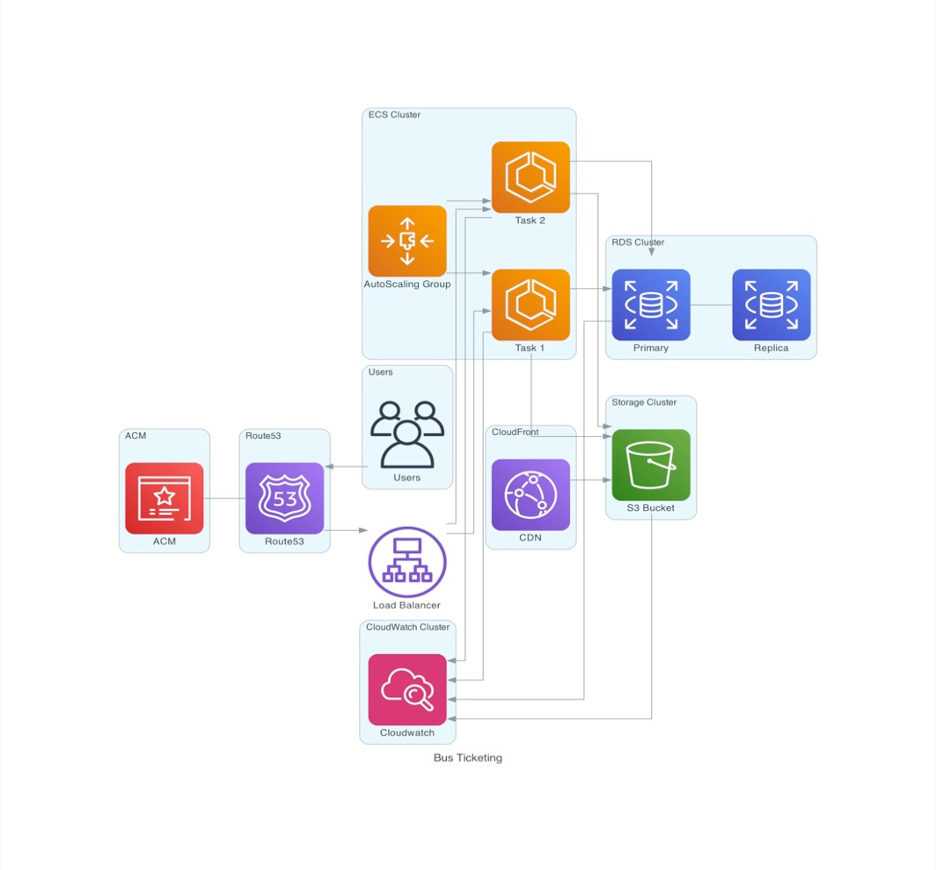

# Book My Bus

### Getting Started

* Clone the repository
* `cd backend` and follow the instructions in the README.md of the backend folder
* `cd ui` and follow the instructions in the README.md of the ui folder

### System Design Architecture

### Seat Booking

### Ticket Download

### Tickets

 
